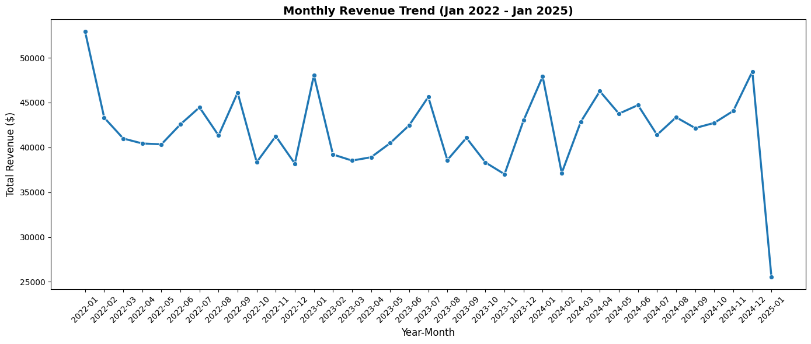
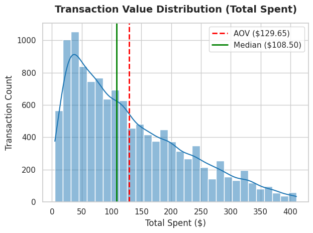
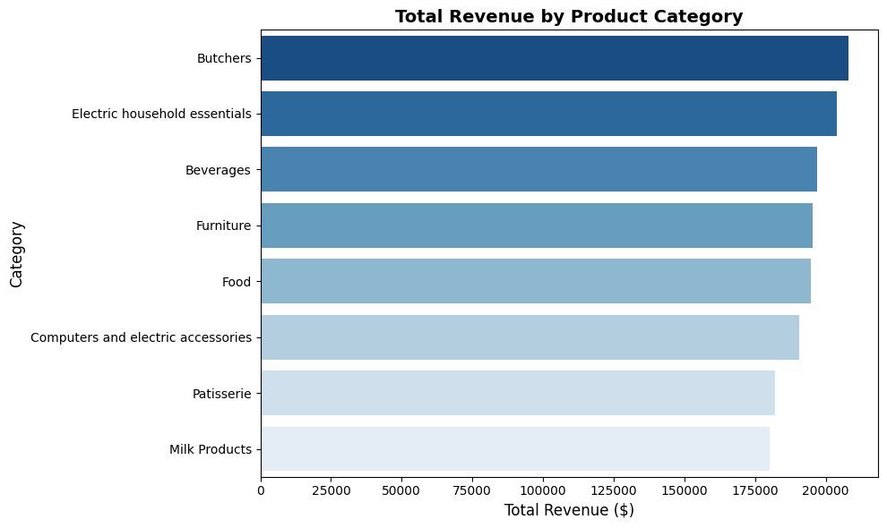
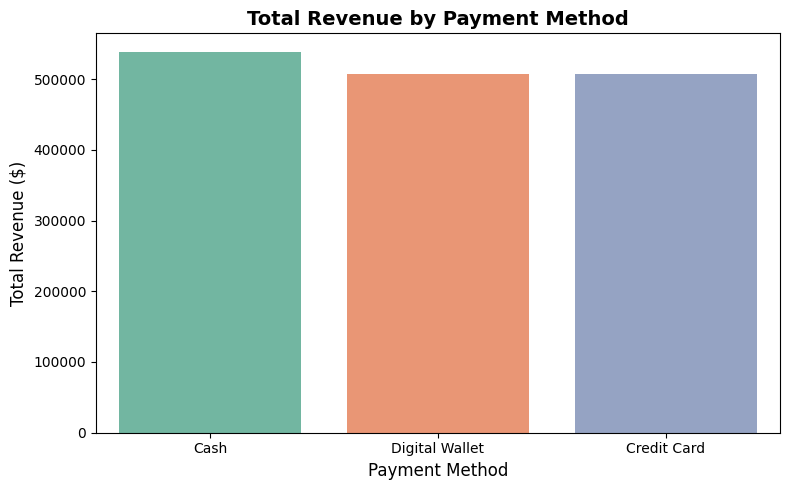

# Retail Store Sales Data Cleaning & Exploratory Data Analysis (Python / Pandas / Colab)

## Executive Summary
This project delivers end-to-end data cleaning, feature engineering, and exploratory data analysis (EDA) on transactional retail sales data using **Python** in **Google Colab**. Raw datasets containing null values, unformatted string dates, negative spent amounts, and structural noise were transformed into an analytics-ready pipeline using **Pandas**. 

The analysis evaluates over **11,970 transactions** generating **$1.55 Million in total revenue** across 8 product categories and 3 primary payment gateways.

---

## Technical Architecture & Tools
* **Environment:** Google Colab / Jupyter Notebook
* **Programming Language:** Python 3.x
* **Core Libraries:** `pandas`, `numpy`, `matplotlib`, `seaborn`
* **Dataset:** [Retail Store Sales - Dirty Data (Kaggle)](https://www.kaggle.com/datasets/ahmedmohamed2003/retail-store-sales-dirty-for-data-cleaning)

---

## Data Cleaning & Transformation Protocol
1. **Handling Missing & Invalid Values:** Imputed missing price and item fields using median values; filtered out zero and negative order totals.
2. **Date Parsing & Type Casting:** Converted string dates into `datetime64` objects to enable temporal aggregations across months and years.
3. **Text Standardization:** Trimmed leading/trailing white spaces, normalized categorical casing, and cleaned item descriptions.
4. **Deduplication:** Identified and eliminated duplicate transaction rows using Pandas `.drop_duplicates()`.

---

## Executive KPI Summary

| Key Performance Indicator | Value |
| :--- | :--- |
| **Total Revenue** | **$1,552,071.00** |
| **Total Transactions** | **11,971** |
| **Unique Customers** | **25** |
| **Average Order Value (AOV)** | **$129.65** |
| **Median Order Value** | **$108.50** |
| **Average Units per Order** | **5.54 Items** |

---

## Key Visualizations & Analytics Findings

### 1. Monthly Revenue Trend (Jan 2022 – Jan 2025)
Monthly revenue remained remarkably consistent between **$38,000 and $48,000**, with peak sales occurring in January 2022 ($52,911.50) and December 2024 ($48,466.50). 



---

### 2. Transaction Value Distribution
Order values exhibit a right-skewed distribution where the **Average Order Value ($129.65)** exceeds the **Median Order Value ($108.50)**, driven by high-volume bulk basket orders up to $410.00.



---

### 3. Product Category Performance
Revenue is evenly balanced across categories, led by **Butchers ($208,118.00)** and **Electric Household Essentials ($203,813.50)**.



#### Category Breakdown Table
| Category | Total Revenue ($) | Transactions | Avg Unit Price ($) | AOV ($) |
| :--- | :--- | :--- | :--- | :--- |
| **Butchers** | $208,118.00 | 1,496 | $25.20 | $139.12 |
| **Electric household essentials** | $203,813.50 | 1,516 | $24.49 | $134.44 |
| **Beverages** | $197,047.50 | 1,496 | $23.30 | $131.72 |
| **Furniture** | $195,310.00 | 1,525 | $23.25 | $128.07 |
| **Food** | $194,812.00 | 1,507 | $23.16 | $129.27 |
| **Computers & electric accessories** | $190,692.50 | 1,477 | $23.10 | $129.11 |
| **Patisserie** | $182,165.50 | 1,441 | $23.04 | $126.42 |
| **Milk Products** | $180,112.00 | 1,513 | $21.34 | $119.04 |

---

### 4. Payment Method Revenue Share
Payment methods demonstrate near-equal market adoption, led slightly by **Cash ($537,710.00)**, followed closely by **Digital Wallet ($507,279.00)** and **Credit Card ($507,082.00)**.



---

## Repository Structure
```text
├── retail_sales_cleaning_eda.ipynb      # Master Google Colab Jupyter Notebook
├── cleaned_retail_sales.csv             # Cleaned output dataset
├── retail_store_sales_report.pdf        # Executive Analytics PDF Report
├── montly_revenue.png                   # Monthly trend plot
├── spend_distribution.png               # Transaction distribution plot
├── total_revenue_by_product_category.png# Category performance plot
├── total_revevue_by_payment_method.png # Payment method split plot
└── README.md                            # Documentation
